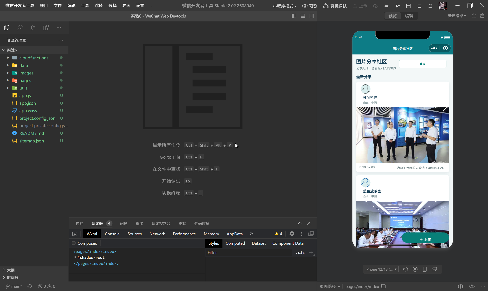
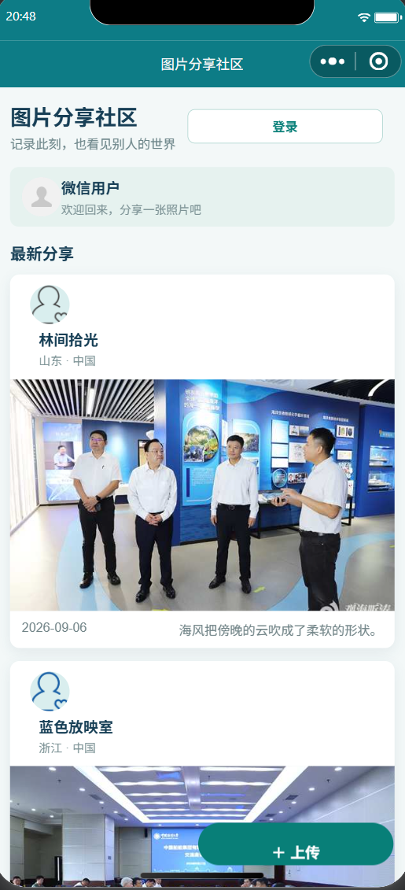
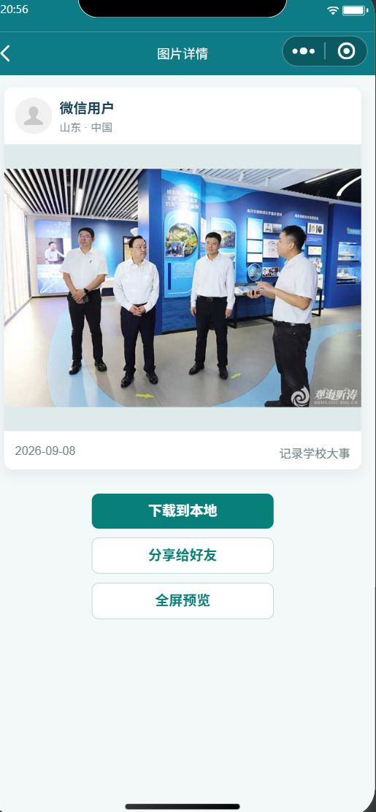
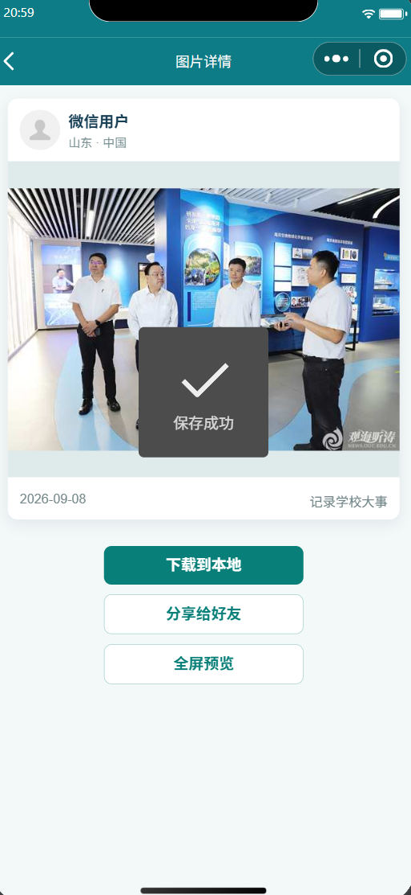

<center>姓名：刘翼晨  学号：24020007077</center>

| 姓名和学号？         | 刘翼晨，24020007077                                          |
| -------------------- | ------------------------------------------------------------ |
| 本实验属于哪门课程？ | 中国海洋大学26夏《移动软件开发》                             |
| 实验名称？           | 实验6：基于云能力的图片分享社区                              |
| 博客地址？           | <https://blog.csdn.net/luoLTL/article/details/164631470>     |
| GitHub仓库地址？     | <https://github.com/junwangchen1541/mobile-software-development> |

## 一、实验内容

### 1. 实验背景

本实验在前面微信小程序页面、事件和页面跳转实验的基础上，引入微信云开发能力，制作一个“图片分享社区”。用户可以浏览所有公开图片，点击作者头像查看个人主页，选择本地图片上传到云存储，并把图片地址、作者信息和上传日期保存到云数据库。图片详情页还需要支持下载到本地、分享给好友和全屏预览。

### 2. 实验目标

1. 掌握微信云开发项目的初始化和云环境配置方法。
2. 理解云存储文件与云数据库记录之间的关联关系。
3. 使用原生 WXML、WXSS 和 JavaScript 实现首页、个人主页、详情页和上传页。
4. 熟悉 `wx.chooseImage`、`wx.cloud.uploadFile`、`wx.cloud.downloadFile`、`wx.saveImageToPhotosAlbum` 和 `wx.previewImage` 等 API。
5. 使用 `openid` 区分用户，并按照用户和日期查询图片历史记录。

### 3. 功能要求

| 功能 | 具体要求 |
| --- | --- |
| 首页 | 按上传日期倒序展示图片、头像、昵称、地区、说明和日期 |
| 个人主页 | 点击头像后查看该用户的头像、昵称和上传历史 |
| 上传图片 | 从相册或相机选择一张图片，上传文件并写入图片元数据 |
| 图片详情 | 查看完整图片和说明，支持下载、分享、全屏预览 |
| 云端数据 | 图片文件保存在云存储，结构化信息保存在 `photos` 集合 |

## 二、开发环境与项目结构

### 1. 开发环境

- 开发工具：微信开发者工具 Stable
- 开发模式：原生微信小程序
- 页面技术：WXML、WXSS、JavaScript
- 云能力：微信云开发、云数据库、云存储、云函数
- 项目目录：`实验6/`

本项目保留了云端实现，同时增加了本地演示模式。当开发者工具尚未配置云环境时，程序自动读取 `data/demo.js` 中的示例图片，并把新上传内容写入本地缓存。配置云环境后，首页查询、上传和详情页会自动切换到云端接口。

<p align="center"></p>
<p align="center">图1　实验 6 项目目录与微信开发者工具工程。</p>

### 2. 项目结构

```text
实验6/
├── app.js                         # 初始化小程序和云能力
├── app.json                       # 注册四个页面和窗口样式
├── app.wxss                       # 全局布局、卡片和按钮样式
├── cloudfunctions/getOpenid/      # 获取当前用户 openid
├── data/demo.js                   # 本地演示图片数据
├── images/                        # 示例图片和头像
├── pages/index/                   # 社区首页
├── pages/homepage/                # 个人主页
├── pages/detail/                  # 图片详情
├── pages/add/                     # 上传图片
└── utils/cloud.js                 # 云端/本地数据适配层
```

`app.json` 注册的页面顺序为首页、个人主页、图片详情和上传页。`utils/cloud.js` 将云环境检测、示例数据读取、本地缓存和图片查找集中管理，页面只负责展示和响应事件，减少了不同页面之间的数据逻辑重复。

## 三、页面设计与实现

### 1. 首页：图片列表与页面跳转

首页通过 `wx:for` 循环渲染图片卡片。每张卡片由作者信息区、图片主体和日期说明区组成。头像使用 `navigator` 跳转到个人主页，图片使用另一个 `navigator` 跳转到详情页，上传按钮固定在页面右下角。

云端查询代码位于 `pages/index/index.js`：

```javascript
loadPhotos() {
  if (cloud.hasCloud()) {
    cloud.collection().orderBy('addDate', 'desc').get({
      success: res => this.setData({ photos: this.normalize(res.data) }),
      fail: () => this.setData({ photos: this.normalize(cloud.allPhotos()) })
    })
  } else {
    this.setData({ photos: this.normalize(cloud.allPhotos()) })
  }
}
```

这里使用 `orderBy('addDate', 'desc')` 保证最新上传的图片位于顶部；云请求失败时仍回退到本地数据，避免页面出现空白。

<p align="center"></p>
<p align="center">图2　图片分享社区首页。</p>

### 2. 个人主页：按用户筛选上传历史

首页头像链接中携带当前图片的 `_openid`，个人主页接收到参数后，在云端使用 `where({ _openid: this.openid })` 查询；离线模式则对相同字段进行本地筛选。页面顶部显示头像、昵称、地区和图片数量，下面按日期展示该用户上传的图片。

<p align="center"></p>
<p align="center">图3　个人主页和上传历史。</p>

### 3. 上传页：选择图片和填写说明

上传页使用 `wx.chooseImage`，同时支持相册和相机。选择成功后，临时文件路径保存到页面状态 `preview`，页面立即显示预览。用户还可以填写图片说明，上传时一并保存到数据库。

```javascript
chooseImage() {
  wx.chooseImage({
    count: 1,
    sizeType: ['compressed'],
    sourceType: ['album', 'camera'],
    success: res => this.setData({ preview: res.tempFilePaths[0] })
  })
}
```

<p align="center"></p>
<p align="center">图4　上传页的图片预览和说明输入框。</p>

### 4. 云存储和云数据库写入

配置云环境时，上传流程分为两步：首先使用 `wx.cloud.uploadFile` 将本地临时文件上传到 `photos/` 目录，得到云文件 `fileID`；然后使用 `cloud.collection().add` 写入图片元数据。数据库记录字段包括 `photoUrl`、`avatarUrl`、`nickName`、`province`、`country`、`addDate` 和 `caption`。

```javascript
wx.cloud.uploadFile({
  cloudPath: 'photos/' + Date.now() + '.jpg',
  filePath: this.data.preview,
  success: res => cloud.collection().add({
    data: {
      photoUrl: res.fileID,
      nickName: user.nickName,
      avatarUrl: user.avatarUrl,
      addDate: new Date().toISOString().slice(0, 10),
      caption: this.data.caption || '分享我的日常瞬间'
    }
  })
})
```

<p align="center"></p>
<p align="center">图5　图片上传成功和历史记录更新。</p>

### 5. 图片详情：下载、分享和预览

详情页根据 `id` 查找图片记录，底部放置三个操作按钮。`downloadPhoto` 负责云文件下载和保存相册，`open-type="share"` 配合 `onShareAppMessage` 打开微信分享面板，`previewPhoto` 调用 `wx.previewImage` 实现全屏预览。

```javascript
previewPhoto() {
  wx.previewImage({
    current: this.data.photo.photoUrl,
    urls: [this.data.photo.photoUrl]
  })
}
```

<p align="center"></p>
<p align="center">图6　图片详情页。</p>

<p align="center"></p>
<p align="center">图7　图片下载或分享功能。</p>

<p align="center"></p>
<p align="center">图8　图片全屏预览。</p>

## 四、云开发配置与运行流程

### 1. 云环境配置

1. 在微信开发者工具中导入 `实验6/`，点击“云开发”并创建云环境。
2. 在云数据库中新建 `photos` 集合。
3. 将集合权限设置为“所有用户可读，仅创建者可写”。
4. 部署 `cloudfunctions/getOpenid`，该云函数通过 `cloud.getWXContext().OPENID` 返回当前用户身份。
5. 在云存储中使用 `photos/` 目录保存上传图片。

### 2. 运行流程

```text
首页加载
   ├─ 云环境可用：查询 photos 集合并按日期倒序展示
   └─ 云环境不可用：读取 data/demo.js 和本地缓存

选择图片 → 预览图片 → 点击上传
   ├─ 云环境可用：uploadFile → photos.add
   └─ 云环境不可用：写入 lab6-photos 本地缓存

点击头像 → 个人主页
点击图片 → 详情页 → 下载 / 分享 / 全屏预览
```

## 五、功能测试与实验结果

| 编号 | 测试内容 | 操作步骤 | 预期结果 |
| --- | --- | --- | --- |
| 1 | 首页加载 | 编译后打开首页 | 显示示例图片、作者信息和上传日期 |
| 2 | 个人主页 | 点击任意图片卡片的头像 | 进入对应用户主页，显示上传历史 |
| 3 | 图片选择 | 进入上传页并点击选择区域 | 可以从相册或相机选择图片并预览 |
| 4 | 图片上传 | 输入说明并点击上传 | 云端写入文件和记录，或写入本地缓存 |
| 5 | 图片详情 | 点击首页图片 | 显示图片、说明、日期和操作按钮 |
| 6 | 下载图片 | 点击“下载到本地” | 显示保存成功提示并写入系统相册 |
| 7 | 分享图片 | 点击“分享给好友” | 打开微信分享面板，路径指向详情页 |
| 8 | 全屏预览 | 点击“全屏预览” | 进入微信原生图片预览界面 |

当前源码已通过 JavaScript 语法检查和 JSON 配置检查。云数据库真实上传、系统相册保存和微信分享在微信开发者工具中完成，图1至图8为本次运行过程截图。

## 六、问题与解决方法

### 1. 没有云环境时页面无法展示

实验文档默认项目已经开通云开发，但源码检查或课堂演示时可能还没有配置云环境。为保证页面可以先运行，项目在 `utils/cloud.js` 中增加了 `hasCloud()` 检测，并准备了三条本地示例记录。云请求失败时，首页和个人主页都会回退到本地数据。

### 2. 图片文件和数据库记录需要保持关联

云存储只负责保存文件，云数据库保存的是文件的 `fileID` 和其他描述字段。因此上传成功后必须先取得 `res.fileID`，再写入 `photos` 集合；不能只保存本地临时路径，否则其他设备无法读取图片。

### 3. 云文件、本地文件和网络文件的下载方式不同

详情页根据地址类型分别处理：`cloud://` 地址使用 `wx.cloud.downloadFile`，HTTP 地址使用 `wx.downloadFile`，本地示例图片直接交给 `wx.saveImageToPhotosAlbum`。这样本地演示和真实云端数据可以使用同一套详情页。

### 4. 用户身份需要在多个页面之间传递

首页头像跳转时携带 `_openid`，个人主页根据参数查询该用户图片；云端写入时不手动伪造 `_openid`，由云数据库创建者权限自动记录，避免用户修改他人身份字段。

## 七、实验总结

本实验完成了一个从图片选择、云存储上传、数据库记录到图片浏览和互动操作的完整小程序原型。通过本实验，我进一步理解了前端页面数据与云端数据之间的对应关系：图片本体放在云存储，图片说明和作者信息放在云数据库，页面通过 `fileID` 将两者关联起来。项目还通过本地兜底模式解决了云环境尚未配置时无法演示的问题。

与前几次实验相比，本实验的难点不再只是页面布局，而是异步上传、数据库写入、用户身份和不同文件地址类型的处理。后续可以继续增加分页加载、图片压缩、评论点赞、内容审核和更严格的云函数鉴权。
